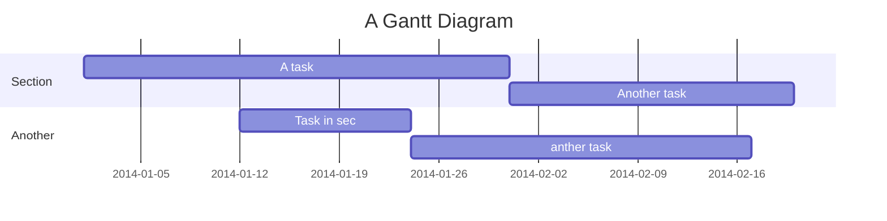

Project Title
===


## Table of Contents

[TOC]

User story
---

```gherkin=
Feature: Job view
    As a job searcher
    I want to be able to see all avalible jobs
    Because I want to select the best possible job for me

  
  Scenario: User searches for Job
    When the User goes to the Job view page
    Then the user provides a criteria for the job they are looking for
    And Jobs fitting that criteria are shown to the user

  
  Scenario: User selects a job
    Given the User is authenticated
    When The User selects a Job
    Then The user's selection will be saved to their profile
    And The user will be directed to apply to the job


Feature: Application
  As someone who wants a job
  I want to apply and have my information recorded
  Because I want jobs to know that I am interested

  Scenario: User applys to a job
    Given the user is authenticated
    When The user is viewing a job
    And The user clicks "apply"
    Then The user fills out an application
    And the time of which they applied is recorded
    And their user identification is recorded
    And the selected job's identification is recorded as well
```

User flows
---


Project Timeline
---


## ScreentoGif Walkthroughs

**First Job Board


**Contains both bonus and assignment


**Contains code and run through of GETS


## Appendix and FAQ

:::info
**Find this document incomplete?** Leave a comment!
:::

###### tags: `Templates` `Documentation`
